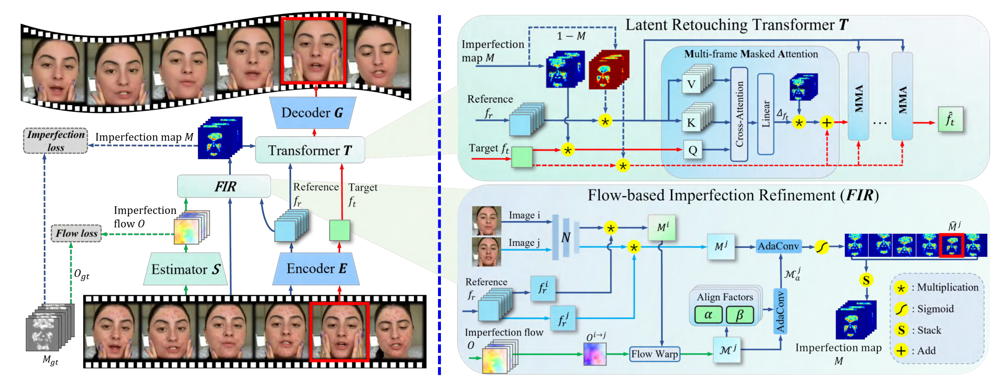

# VRetouchEr:  Learning Cross-frame Feature Interdependence with Imperfection Flow for Face Retouching in Videos



[Wen Xue](https://scholar.google.com.hk/citations?user=OXAPkaEAAAAJ&hl=zh-CN&oi=sra), [Le Jiang](https://openreview.net/profile?id=~Le_Jiang3), [Lianxin Xie](https://openreview.net/profile?id=~Lianxin_Xie3), [Si Wu](https://scholar.google.com.hk/citations?user=RtkXrnwAAAAJ&hl=zh-CN&oi=sra)*, [Yong Xu](https://scholar.google.com/citations?user=1hx5iwEAAAAJ)*, [Hau-San Wong](https://scholar.google.com.hk/citations?user=i9Dh1OkAAAAJ&hl=zh-CN)<br/>

[South China University of Technology](https://www.scut.edu.cn/en/), [Shantou University](https://www.stu.edu.cn/) [City University of Hong Kong](https://www.cityu.edu.hk/)

This is the official code of **CVPR 2024**: *VRetouchEr: Semi-supervised High-Quality Face Retouching Transformer with Prior-Based Selective Self-Attention*.

<blockquote> <strong>Abstract:</strong> <em>Face Video Retouching is a complex task that often requires labor-intensive manual editing. Conventional image retouching methods perform less satisfactorily in terms of generalization performance and stability when applied to videos without exploiting the correlation among frames. To address this issue, we propose a Video Retouching transformEr to remove facial imperfections in videos, which is referred to as VRetouchEr. Specifically, we estimate the apparent motion of imperfections between two consecutive frames, and the resulting displacement vectors are used to refine the imperfection map, which is synthesized from the current frame together with the corresponding encoder features. The flow-based imperfection refinement is critical for precise and stable retouching across frames. To leverage the temporal contextual information, we inject the refined imperfection map into each transformer block for multi-frame masked attention computation, such that we can capture the interdependence between the current frame and multiple reference frames. As a result, the imperfection regions can be replaced with normal skin with high fidelity, while at the same time keeping the other regions unchanged. Extensive experiments are performed to verify the superiority of VRetouchEr over state-of-the-art image retouching methods in terms of fidelity and stability. </em> </blockquote>

------

## Main contributions:
- We propose VRetouchEr, a novel face video retouching approach that addresses the challenging of imperfection localization and removal over image sequences. 

- By estimating imperfection flow to correct the imperfection localization in each frame, the obtained spatial information becomes more stable and reliable, which is beneficial to stabilizing the retouching performance. 

- By performing multi-frame masked attention computation, VRetouchEr is able to leverage the contextual information from different frames and synthesize more precise retouching results than the existing methods operating on a single frame. 
------

## Setup Instructions

To run VRetouchEr, follow these steps:

### 1. Install Requirements

- Install and activate the required packages using the requirements.txt file:

  ```
  conda create -n vretoucher python=3.8
  pip install -r requirements.txt
  ```

### 2. Download Dataset

- Obtain the **Flickr-Faces-HQ-Retouching (FFHQR) Dataset**.

- Arrange the dataset in the following structure:

  ```
  face_retouching/
  ├── train/
  │   ├── source/
  │   └── target/
  └── test/
      ├── source/
      └── target/
  ```

### 3. Train the Model

- Navigate to the project directory and activate the environment:

  ```bash
  cd VRetouchEr
  conda activate vretoucher
  python train_video.py
  ```


------

## Testing Instructions

To test VRetouchEr:

1. **Navigate to the Project Directory**:

   ```bash
   cd VRetouchEr
   ```

2. **Run the Testing Script**:
   Execute the testing script with:

   ```bash
   python video_retouching.py
   ```